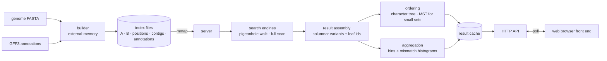

# sentromap-rs — design specification

**Status:** founding design document for a new Rust repository.
**Supersedes:** the Go prototype `sentromap_core2` (branch `genome-index`, commits `b6a8f75`, `dfa4f6a`, `79de80d`).
**Audience:** engineers and coding agents building the Rust implementation from scratch. It assumes no access to the prototype conversation; everything needed is here, including the measurements behind each decision and the approaches that were tried and rejected.

---

## Contents

1. [What we are building](#1-what-we-are-building)
2. [Fixed decisions and non-goals](#2-fixed-decisions-and-non-goals)
3. [What the prototype taught us](#3-what-the-prototype-taught-us)
4. [System overview](#4-system-overview)
5. [Encoding and coordinates](#5-encoding-and-coordinates)
6. [Index format](#6-index-format)
7. [Search](#7-search)
8. [Result assembly](#8-result-assembly)
9. [Ordering: the cladogram](#9-ordering-the-cladogram)
10. [Aggregation for annotation strips](#10-aggregation-for-annotation-strips)
11. [Genome annotations (GFF3)](#11-genome-annotations-gff3)
12. [Server and web API](#12-server-and-web-api)
13. [Building the index within a memory budget](#13-building-the-index-within-a-memory-budget)
14. [Repository layout](#14-repository-layout)
15. [Testing and verification](#15-testing-and-verification)
16. [Performance targets and benchmarks](#16-performance-targets-and-benchmarks)
17. [Datasets](#17-datasets)
18. [Milestones](#18-milestones)
19. [Open decisions](#19-open-decisions)
20. [Appendices](#20-appendices)

---

## 1. What we are building

A new kind of genome browser. The user selects a 31-base sequence (a k-mer) anywhere in a reference genome, and the browser near-instantly shows **every place in the genome within n substitutions of it, on either strand**, as annotation strips alongside the genome's existing annotations (genes, repeats, satellites).

The user scrolls through n (0, 1, 2 … up to about 15) and watches the pattern evolve: at n=0 a unique sequence lights up once; as n grows, its repeat family, then distant relatives, then chance look-alikes appear across the genome. The goal is to expose the genome's superstructure with respect to short sequences, at arbitrary non-local variation depth.

Matches are grouped by their **variant** (the exact 31-mer found, written in the query's orientation). Variants are arranged by a simple **cladogram** built from their shared substitutions, so related copies sit together and the annotation strips can be read as families.

The system is:

- an **offline builder** that turns one genome FASTA into an index on disk, runnable on a workstation;
- a **long-running server** that memory-maps the index and answers queries polled from a web front end.

Target scale: the human genome (about 3.1 Gb) on a single machine with **64 GB of RAM**, answering n up to 15 in about a second. A query that takes several seconds, or even around 30 s, is acceptable if the estimated time is quoted to the user when they click.

## 2. Fixed decisions and non-goals

Decided (do not revisit without new evidence):

| Decision | Reason |
|---|---|
| Rust | Performance, memory control, safe concurrency for the server. |
| k = 31, fixed | 62 bits fit a `u64` with room to spare; odd k means no k-mer equals its own reverse complement. |
| Substitutions only (Hamming distance) | Indels are out of scope. |
| One reference genome per index | No multi-sample unions, no read data. A multi-record FASTA (chromosomes, scaffolds, organelles) is one genome. |
| Canonical k-mers only in the index | Each k-mer and its reverse complement stored once; search runs the query and its reverse complement and reconciles (section 7.6). |
| Positions are part of the index | Every occurrence of every k-mer is retrievable, with strand. |
| Our own k-mer enumeration | No KMC or other external counter. |
| No FM-index / BWA-style approach | Rejected by the project owner. |
| Server polled from the web | The browser front end polls a stateful query service. |

Non-goals: read mapping, variant calling, assembly, phylogenetic inference with evolutionary models (a simple cladogram is enough), indel-tolerant search, multiple k.

## 3. What the prototype taught us

The Go prototype went through three designs. Every recommendation below comes from its measurements.

### 3.1 Test machine

AMD Ryzen 9 7900X (12 cores / 24 threads, 32 MB L3), DDR5, WSL2 with 15 GB RAM. Parallel runs used 12 or 24 threads. Measured sustained memory bandwidth on a streaming scan: about 50 GB/s.

### 3.2 Genomes indexed

| Genome | Bases | Records | k-mer sites | Distinct canonical 31-mers (N) | log₄N |
|---|---|---|---|---|---|
| E. coli K-12 MG1655 | 4,641,652 | 1 | 4,641,622 | 4,554,269 | 11.0 |
| S. cerevisiae R64 | 12,157,105 | 17 | 12,156,595 | 11,564,096 | 11.7 |
| D. melanogaster r6 | 143,726,002 | 1,870 | 142,499,764 | 122,317,344 | 13.4 |
| Human (estimate) | ~3.1e9 | — | ~3.05e9 | ~2.5e9 | ~15.6 |

The human N is an estimate; measure it on the chosen assembly early (milestone M5).

### 3.3 The byte-trie design is a dead end for high n

The prototype's index was a compact trie: one byte per node (4 child bits and a 4-bit offset) plus offset tables every 4 and 64 nodes, down to depth 19, with branches that stopped branching cut off as packed 12-base suffixes. Search was a depth-first walk that stopped once the mismatch budget was spent.

It was correct (verified against brute force) but slow at high n, and the reason is structural:

- Node visits follow the Hamming ball (Σ C(d,j)·3^j) until a row saturates at about depth log₄N, then every surviving path is a chain of one-child nodes down to the split. At n=15 on D. mel the walk made **738 M node visits for 122 M k-mers**, about 6 per k-mer, almost all in depths 13–19.
- Each visit moves to a different row array, and at D. mel scale those arrays far exceed cache: **about 17 ns per visit** against **1.25 ns per k-mer** for a sequential scan.
- The trie also cost about 12.6 bytes per k-mer (1.54 GB for D. mel) plus positions.

D. mel, median per-query times, both strands:

| n | Trie walk (1 thread) | Full scan (1 thread) | Full scan (12 threads) | Pigeonhole index (12 threads) |
|---|---|---|---|---|
| 0–3 | ≤ 1.3 ms | 152 ms | 20 ms | ≤ 0.02 ms |
| 4 | 13 ms | 152 ms | 20 ms | 0.07 ms |
| 6 | 166 ms | 152 ms | 20 ms | 0.28 ms |
| 8 | 1.1 s | 152 ms | 20 ms | 1.7 ms |
| 10 | 4.1 s | 152 ms | 20 ms | 6.5 ms |
| 12 | 9.0 s | 152 ms | 20 ms | 16 ms |
| 15 | 15 s | 152 ms | 20 ms | 36 ms |

A full trie traversal took 13 s; a full scan of the same k-mers, 152 ms single-threaded. **The fix is a flat, streamable layout, not a smarter walk.**

### 3.4 The floor is a full scan at memory bandwidth

Comparing a query against every k-mer is O(N) but with a tiny constant: XOR, fold, popcount, for both strands in one pass. On D. mel it runs at about 50 GB/s on 12 cores (20 ms for 1 GB of `u64` k-mers), flat in n. Nothing exact does much better at n ≈ 15 of 31, because the Hamming ball there covers a large fraction of all k-mer space.

### 3.5 Pigeonhole multi-indexing is the big-O win for low and mid n

If a k-mer is within n of the query, then its first 15 bases or its last 16 bases are within ⌊n/2⌋ of the query's. Two sorted copies of the k-mers (one as-is, one rotated so the back half leads) let each copy's prefix walk spend only half the budget. Fraction of the index touched:

| n | Single prefix table, 15 bases | Pigeonhole, two copies |
|---|---|---|
| 8 | 5.7% | 0.015% |
| 10 | 31% | 0.11% |
| 12 | 76% | 0.58% |
| 15 | 100% | 2.5% |

Measured on D. mel (section 3.3 table), the pigeonhole index beats the parallel full scan up to n ≈ 13; beyond that the scan is equal or better. On human, with 2.3 k-mers per 15-base prefix instead of D. mel's ~0.1, the balance shifts further in the pigeonhole index's favour.

### 3.6 Prefix walks over too-deep tables backfire

A single prefix table walked to depth s then scanned ("bucket-s") was measured at s = 8, 10, 12, 14. At high n, enumerating the prefix ball costs more than scanning: bucket-14 took **3.3 s at n=15** on D. mel against 20 ms for the scan. Walk depth must be chosen per query from a cost model (section 7.5), with the full scan as fallback.

### 3.7 Output is the next bottleneck

Expected chance matches for a random query grow about 4–5× per extra mismatch (section 20.1). A random query at n=15 is expected to hit about **6.5 M k-mers in human**, and real genomes have repeats, so often more.

The prototype's result assembly (per-site structs, strings, contig lookups) cost about **1 µs per site**: 1 s for the 920 k sites of a D. mel n=15 query, 25× the search time of the fast engines. Results must stay columnar and compact, and the browser must receive aggregates, not site lists (sections 8 and 10).

### 3.8 Search once at max n, filter for smaller n

Scan cost is flat in n and the pigeonhole cost grows slowly. Run one search at the user's maximum n, tag every variant with its mismatch count, and serve every smaller n by filtering. Scrolling through n then costs nothing.

### 3.9 Ordering is cheap; the hard parts are quality and stability

Measured on real D. mel result sets (section 9 has details):

- The shared-derived-character tree costs **about 50 ns per variant on 12 threads** (6.1 M variants in 327 ms), about 300 ns single-threaded.
- On real families at low n it produces trees 20–50% longer than an exact minimum spanning tree, which is O(M²) and only affordable below about 25 k variants.
- At high n most hits are chance look-alikes, not relatives, so every method is close to a star tree. There is little real tree to find there.
- Re-ranking per n gives the best trees but reshuffles the order as n changes; freezing the ranking at max n is perfectly stable but 10–40% worse on families at mid n. Two smarter fixed rankings were tried and did not help.

### 3.10 In-memory building does not scale

The prototype built everything in RAM: about 73 bytes per base at D. mel scale (10.5 GB peak with a capped heap). Human would need over 200 GB. The Rust builder must be external-memory (section 13).

### 3.11 Bugs worth designing tests against

The prototype's trie had several subtle bugs. They are listed as test ideas, not because the new design shares the code:

- Offset tables indexed by position in the full 4^d space instead of by dense row position. It only showed once some prefixes were empty, which canonical-only indexing guaranteed.
- A 12-base suffix compared with a 12-bit mask (6 bases).
- Leaf-to-k-mer lookup files written in one order and read in another.
- A buffer handed to a writer goroutine then immediately reused (a data race that silently corrupted a file).
- Precedence bugs in bit arithmetic (`a >> b - c`, `x << i * 2`).

## 4. System overview



Flow of one query:

1. The client posts a 31-mer and a maximum n. The server validates it, normalises it to canonical form, checks the cache, and returns a job id with a time estimate.
2. The engine selector picks the pigeonhole walk or the full scan for that n (section 7.5), runs it on the worker pool, and collects variants.
3. Result assembly attaches each variant's leaf id, mismatch count and orientation, without materialising sites.
4. Ordering builds the cladogram; aggregation builds per-bin, per-mismatch-count histograms.
5. The client polls for status, then pulls summaries for its viewport and n, and pulls detail (sites, tree segments) on zoom.

## 5. Encoding and coordinates

### 5.1 Bases and k-mers

- Bases are 2-bit: **A=0, C=1, G=2, T=3**. Complement is `x ^ 3`.
- A k-mer is a `u64` with the **first base in the most significant position** (bits 61–60) and the last base in bits 1–0. Bits 62–63 are zero.
- Input bases are case-insensitive (soft-masked lowercase is sequence). Any other character (N, IUPAC codes) breaks the k-mer: no k-mer containing it is indexed.
- **Canonical** k-mer: `min(k, revcomp(k))`.
- k-mers never span two FASTA records.

Reverse complement without loops:

```rust
const K: u32 = 31;
fn revcomp(mut k: u64) -> u64 {
    k = !k;
    k = (k >> 2 & 0x3333_3333_3333_3333) | (k & 0x3333_3333_3333_3333) << 2;
    k = (k >> 4 & 0x0F0F_0F0F_0F0F_0F0F) | (k & 0x0F0F_0F0F_0F0F_0F0F) << 4;
    k.swap_bytes() >> (64 - 2 * K)
}
```

Hamming distance on packed k-mers:

```rust
fn diff_mask(a: u64, b: u64) -> u64 { let x = a ^ b; (x | x >> 1) & 0x5555_5555_5555_5555 }
fn hamming(a: u64, b: u64) -> u32 { diff_mask(a, b).count_ones() }
```

The low bit of each base pair in `diff_mask` marks a differing base; base index `i` (0 = first) is bit `2*(30-i)`.

### 5.2 Coordinates

- All FASTA records are concatenated into one **global coordinate space** (`u32`, 0-based, no separators). Genomes over 2³² − 1 bases are rejected at build time; human (about 3.1 Gb) fits.
- A contig table maps global coordinates back to (record name, 0-based offset).
- A site's **position** is the global coordinate of the k-mer's first base on the forward strand.
- API output is **1-based and inclusive**, like GFF: a site spans `start .. start+30`.
- **Strand** is relative to the variant: `+` means the forward strand at that position reads the variant; `-` means the forward strand holds the variant's reverse complement.

## 6. Index format

All files are little-endian, start with a magic string, a format version, and a header describing their sections, and are designed to be **memory-mapped** and used in place (`#[repr(C)]` headers via `zerocopy` or `bytemuck`; section offsets aligned to 64 bytes). The server never copies them into the heap.

### 6.1 Parameters

- **P** is the prefix length for both sorted copies. **P = 15 for human-scale genomes.** For smaller genomes P adapts so the table isn't mostly empty: `P = clamp(round(log₄N), 8, 15)` (yeast → 12, D. mel → 13 or 14, human → 15).
- **S = 31 − P** is the suffix length. At P = 15, S = 16 bases = exactly 32 bits, so a suffix is one `u32`. For P < 15, suffixes need up to 46 bits and are stored as `u64`. Implement suffix storage generically (`trait SuffixWord: u32 | u64`) so the fast `u32` path isn't penalised by the small-genome case.

### 6.2 Copy A: the primary sorted k-mer set

All distinct canonical k-mers, sorted ascending, split as prefix (first P bases) and suffix (last S bases):

- **Prefix table:** for each of the 4^P prefixes, the index of its first k-mer; 4^P + 1 entries. Bucket p holds `suffixes[table[p] .. table[p+1]]`.
- **Suffix array:** one suffix word per k-mer, sorted within each bucket.
- **Leaf id** of a k-mer = its index in copy A. This is the key into the positions file.

Prefix table storage options:

| Option | Human size | Notes |
|---|---|---|
| Plain `u32` per bucket | 4.3 GB | Simplest; `N < 2³²` holds for human. |
| `u64` every 64 buckets + `u16` per bucket relative to it | ~2.3 GB | The builder must verify that no 64-bucket block exceeds 65,535 k-mers, falling back to the plain table if one does. This is the same two-level rank idea as the prototype's rem4/rem64 offsets. |

Start with the plain table; compress later if memory is tight.

### 6.3 Copy B: the rotated copy for pigeonhole search

The same k-mers, **rotated so the back 16 bases lead**:

```rust
const BACK16: u64 = (1 << 32) - 1;
fn rotate(k: u64) -> u64 { (k & BACK16) << 30 | k >> 32 }
```

A rotated k-mer is bases 15..30 followed by bases 0..14. Copy B is the rotated set, sorted, stored exactly like copy A (prefix table on the first P rotated bases, suffix words). At P = 15 the prefix is bases 15..29 and the `u32` suffix is base 30 followed by bases 0..14.

Copy B **stores no leaf ids** (that would add 10 GB for human). A hit found in B is mapped to its leaf id by looking the un-rotated k-mer up in copy A: one table read plus a binary search over a bucket of about 2.3 entries on average.

### 6.4 Positions (the "tether")

A ragged 2D array: row l lists every genome position of leaf l's canonical k-mer, ascending.

- **positions:** `u32` per site, rows concatenated in leaf order (human ≈ 3.05e9 × 4 B = 12.2 GB).
- **strand bits:** one bit per site: 1 when the forward strand at that position holds the canonical k-mer (0.38 GB).
- **row starts:** a bitvector over sites with a 1 at the first site of each row, plus a select index, so row l is `select1(l) .. select1(l+1)` (0.38 GB + ~50 MB). This replaces a `u32` offset per k-mer (10 GB for human). Elias–Fano over the row offsets is an equivalent alternative.

Since leaf ids follow sorted canonical order, the builder writes positions in the same order it writes copy A, one partition at a time (section 13).

### 6.5 Contigs and metadata

- **contigs:** name, global offset, length per FASTA record.
- **manifest:** format version, K, P, N, site count, source FASTA path and checksum, build parameters and timestamps, per-file checksums.
- **annotations:** see section 11.

### 6.6 Memory budget for human

| Component | Plain | Compressed tables |
|---|---|---|
| Copy A prefix table | 4.3 GB | 2.3 GB |
| Copy A suffixes (`u32`) | 10.0 GB | 10.0 GB |
| Copy B prefix table | 4.3 GB | 2.3 GB |
| Copy B suffixes (`u32`) | 10.0 GB | 10.0 GB |
| Positions (`u32`) | 12.2 GB | 12.2 GB |
| Strand + row-start bits + select | 0.8 GB | 0.8 GB |
| Contigs, manifest, annotations | < 0.5 GB | < 0.5 GB |
| **Total** | **~42 GB** | **~38 GB** |

That leaves 20+ GB on a 64 GB machine for the OS, the result cache and query working sets. Without copy B (full-scan-only mode) the index is about 27 GB. For comparison, the prototype trie plus positions would have been about 50–55 GB, and far slower.

## 7. Search

### 7.1 Contract

```rust
fn search(index: &Index, query: u64 /* 31-mer, any orientation */, max_n: u8) -> ResultSet
```

`ResultSet` holds every **variant**: a genome k-mer within `max_n` substitutions of the query, written in the **query's orientation**, with its mismatch count and leaf id. Sites are resolved lazily from leaf ids (section 8).

### 7.2 Both strands from a canonical index

The index holds canonical k-mers only. A genome site matches the query on the forward strand if its forward k-mer is within n of `q`, and on the reverse strand if its forward k-mer is within n of `revcomp(q)`. So:

- search the index for `q` → each hit h (canonical) is variant `v = h`;
- search the index for `rc = revcomp(q)` → each hit h is variant `v = revcomp(h)`, with `hamming(q, v) = hamming(rc, h)`.

A k-mer can legitimately appear under both: as `h` (distance to q) and as `revcomp(h)` (distance to rc). Those are two different variants with different strands at the same sites. Keep both.

### 7.3 Engine 1: full scan

Stream copy A in order. For each bucket p (implicit prefix) and each suffix word s, rebuild `k = p << 2S | s` and test `hamming(q, k) ≤ n` and `hamming(rc, k) ≤ n` in the **same pass**.

- Parallelise over contiguous bucket ranges (rayon, chunks of a few MB).
- It's memory-bandwidth-bound: human copy A is about 14 GB, so about 0.3–0.4 s at 40–50 GB/s.
- SIMD: with `u32` suffixes, process 8 (AVX2) or 16 (AVX-512) lanes per step; use `vpopcntq` when `is_x86_feature_detected!("avx512vpopcntdq")`, otherwise a nibble-LUT popcount or scalar `count_ones` built with `target-cpu=native`. Keep a portable scalar fallback, and keep the scalar path as the correctness reference.
- Bucket-level early rejection: compute the prefix distance once per bucket; if it already exceeds n for both q and rc, skip the bucket's suffixes. At high n this rarely prunes; at mid n it helps.

### 7.4 Engine 2: pigeonhole two-copy walk

Let `r = ⌊n/2⌋`, `lead15(k)` = bases 0..14 and `back16(k)` = bases 15..30. For any hit, `hamming(lead15) + hamming(back16) ≤ n`, so at least one half is within r.

For each of q and rc, run two walks:

- **Walk A:** depth-first over the first P bases of copy A's prefix space with budget r. In each bucket reached, accept suffix entries with `hamming(full) ≤ n` **and** `hamming(lead15) ≤ r`.
- **Walk B:** the same over copy B with the rotated query. Accept entries with `hamming(full) ≤ n` **and** `hamming(lead15) > r` (compare lead15 in its rotated position).

This finds every hit exactly once. With a = hamming(lead15) and b = hamming(back16):
- If a ≤ r, walk A reaches it (its prefix lies within lead15, costing ≤ a ≤ r) and walk B rejects it.
- If a > r, then b ≤ n − a ≤ n − r − 1 ≤ r (because n ≤ 2r + 1), so walk B reaches it and accepts it.

Implementation notes:

- The walk enumerates prefix digits with an explicit stack, pruning when the budget is spent. Empty buckets still cost a table read; that is the walk overhead the cost model must account for.
- Parallelise by fanning out over the first 3 prefix bases (64 subtrees × 4 walks = up to 256 tasks) on a work-stealing pool.
- Hits from walk B are mapped to leaf ids through copy A (section 6.3).

### 7.5 Engine selection

Estimate each engine's cost before running:

- **Pigeonhole:** `walk_steps × c_walk + entries_scanned × c_entry`, with `walk_steps ≈ 4 × Ball(P, r)` (capped at `4 × 4^P`) and `entries_scanned ≈ 4 × N × Ball(P, r) / 4^P`.
- **Full scan:** `N × c_scan`.

Here `Ball(d, r) = Σ_{j≤r} C(d, j)·3^j`. Calibrate the constants at server start-up with a short microbenchmark on the loaded index, and store them. Choose the cheaper engine; the same estimate, plus expected output size (section 20.1), is the time quoted to the user.

On D. mel the crossover was n ≈ 13. On human the pigeonhole index should win higher: at n = 15, 4 × Ball(15, 7) ≈ 74 M walk steps and about 170 M entries scanned, against 2.5 G entries for a full scan.

### 7.6 Reconciliation

For a variant `v` from leaf l, flipped = (it came from the rc search), and each site with strand bit `fwd_is_canonical`:

```
strand = if fwd_is_canonical != flipped { '+' } else { '-' }
```

Mismatch positions for display are the set bits of `diff_mask(q, v)`.

### 7.7 Query normalisation and caching

`search(q)` and `search(revcomp(q))` return mirror images: every variant reverse-complemented, every strand flipped. Cache results under `canonical(q)` and mirror on the way out. The cache key is `(canonical(q), max_n)`, and a result for a larger max_n serves any smaller n by filtering.

### 7.8 Limits

- `max_n ≤ 17` is the recommended API cap: character-tree keys pack 18 ranks into a `u128` (section 9.2), and result sets beyond that are dominated by chance hits.
- Reject queries that aren't exactly 31 ACGT bases (case-insensitive).

## 8. Result assembly

The prototype's per-site structs cost about 1 µs per site. The Rust version must stay columnar:

```rust
struct ResultSet {
    query: u64,               // canonical form; orientation handled on output
    max_n: u8,
    variants: Vec<u64>,       // in query orientation
    mismatches: Vec<u8>,
    leaf: Vec<u64>,           // row in the positions file
    flipped: BitVec,          // came from the revcomp search
    order: Vec<u32>,          // cladogram order (section 9)
    tree: TreeIntervals,      // clade structure (section 9)
    site_count: u64,          // sum of row lengths
}
```

- **Don't copy sites.** Rows live in the memory-mapped positions file; resolve them when a request needs them (a viewport, a clade, an export).
- **Contig lookup:** binary search the contig table, or keep a small lookup keyed by global position >> 20 for O(1) access.
- **Sizes:** at human n=15 expect 3–10 M variants (about 20 B each, ~200 MB) and tens of millions of sites (not materialised).

## 9. Ordering: the cladogram

### 9.1 Idea

Every variant differs from the query by up to n substitutions, each a **(position, base)** pair. Treat those as derived characters with the query as the root (ancestor). Variants that share derived characters form clades. That's the classic shared-derived-character approach, and sorting gives it in O(M log M), where M is the number of variants.

### 9.2 Algorithm: the shared-character tree

1. **Character ids:** `id = position * 4 + base` (position 0..30, the variant's base at that position). 124 ids, 93 of which can occur.
2. **Rank characters by frequency** across the variants, most common first (rank 1 = most shared). Ties break by id.
3. **Key per variant:** its characters' ranks in ascending order, packed 7 bits each, most-shared first, into a `u128` (up to 18 ranks), zero-terminated. Ties between keys are impossible because different variants have different character sets.
4. **Sort** the keys: this is a pre-order traversal of a trie over rank lists, with ancestors before descendants and each clade contiguous. This is Gusfield's perfect-phylogeny construction: exact when the characters are compatible, a sensible greedy tree when they aren't.
5. **Tree structure** from the sorted keys in O(M): the longest common prefix (in rank fields) between neighbours defines the clade nesting. Build nested intervals `(depth, start, end)` with a stack, as with an LCP array.
6. **Tree length** (parsimony score) = Σ (key length − LCP with previous key). Report it as a quality metric.

Parallelise character counting and key building over chunks, then run a parallel sort. Use a radix sort on the 7-bit digits (MSD, 128-way) if profiling shows the comparison sort dominates. The prototype used a comparison sort, so a radix sort is expected to be 2–3× faster but untested.

### 9.3 Small result sets: exact trees

When M ≤ about 25,000 (typically low n, where the structure is real), compute an exact **minimum spanning tree** over the variants plus the query, rooted at the query, and order by pre-order with children visited nearest-first. It's O(M²) with no stored matrix: 25 k variants took 1.2 s single-threaded in the prototype, and it parallelises well.

UPGMA via the nearest-neighbour-chain algorithm gives a true rooted binary dendrogram, but costs O(M²) memory (6.2 k variants took 0.4 s; 100 k would need about 20 GB). Offer it only for small sets, and only if the front end wants a strict binary tree.

### 9.4 Measured cost

D. mel result sets, 12 threads unless noted:

| Variants | Character tree (12 thr) | Character tree (1 thr) | Plain sort (1 thr) | Exact MST (1 thr) |
|---|---|---|---|---|
| 6 k | 0.7 ms | 1.1 ms | 0.12 ms | 65 ms |
| 25 k | 1.6 ms | 4.8 ms | 0.55 ms | 1.2 s |
| 400 k | 16 ms | 99 ms | 12 ms | — |
| 1.97 M | 100 ms | 549 ms | 84 ms | — |
| 6.1 M | 327 ms | 1.87 s | 240 ms | — |

### 9.5 Measured quality

Tree length per variant (lower is better). A star tree (no shared clades) scores the mean mismatch count; shared clades push the score towards 1.

| Query (D. mel) | n | Variants | Star | Character tree | Frozen ranking | Exact MST | UPGMA |
|---|---|---|---|---|---|---|---|
| repeat `AGTACGGGAC…` | 4 | 2,016 | 2.78 | 1.30 | 1.41 | 1.09 | 1.14 |
| | 10 | 5,426 | 6.35 | 1.98 | 2.76 | 1.30 | 1.42 |
| | 12 | 9,621 | 8.64 | 3.57 | 4.60 | 2.65 | 2.57 |
| | 15 | 177,778 | 14.37 | 9.99 | 9.99 | — | — |
| unique `AAGCGTCTTT…` | 12 | 15,396 | 11.74 | 8.06 | 8.07 | 7.67 | — |
| | 15 | 692,560 | 14.57 | 8.93 | 8.93 | — | — |

Takeaways:
- On real families the character tree is the best of the cheap methods, and within 20–50% of the exact MST.
- At high n all methods stay close to the star tree: most hits are chance look-alikes with no shared history. Ordering there is mostly cosmetic, and the UI should say so (section 9.7).

### 9.6 Stability across n

Two modes. The choice is a UX decision still open (section 19).

- **Per-n ranking** (best trees): recompute the ranking for the current n. The order reshuffles as the user scrolls; the front end should animate the transitions.
- **Frozen ranking** (perfectly stable): rank characters once on the max-n result set and reuse that ranking at every n. Then **every smaller-n order is exactly a subsequence of the max-n order** (verified at every n in the prototype). Costs nothing on unique or random queries, but trees are 10–40% longer on families at mid n.

Two stable alternatives were tested and **rejected**: ranking by the smallest n at which a character first appears, and weighting each variant's vote by the inverse number of k-mers at its distance, C(31, m)·3^m. Neither beat the frozen ranking. The data explains why: a family's shared structure sits in its 5–10-mismatch members, not only its closest ones, so per-n frequency is the right greedy signal.

### 9.7 The chance background

For a random query, the expected number of chance hits is `2 · N · Ball(31, n) / 4^31` (both strands). For D. mel that's about 160 at n=10 and 318 k at n=15; for human, about 3.3 k and 6.5 M. Show this line in the UI next to the observed count so users can see when they've scrolled past real homology into noise.

## 10. Aggregation for annotation strips

The browser never receives millions of sites. The server returns per-bin summaries for the current viewport and n.

- **Bins:** a zoom pyramid over the global coordinate space (for example 2^k bins per level), clipped to contigs.
- **Histograms:** for each bin, counts of sites by mismatch count (0..max_n). The count for n is the prefix sum over mismatch counts ≤ n, so scrolling n needs no recomputation.
- **Clade strips:** cut the cladogram at a chosen depth (or keep the top K clades by site count); per clade, per bin, the same histogram. Each clade becomes one annotation strip, ordered as in the cladogram.
- **Compute once per result:** build the coarsest level eagerly when the search finishes (one pass over the rows of all variants); build finer levels lazily per viewport and cache them.
- **Detail on zoom:** below a threshold (for example under 5,000 sites in view), return the actual sites with variant id, strand and mismatch positions.

## 11. Genome annotations (GFF3)

- Parse GFF3 at build time into a compact table: seqid mapped to the contig index, start, end, strand, type, and name/ID attributes; store it next to the index.
- Build an interval index (sorted by start with a max-end augmentation, or a cache-oblivious interval tree such as `coitrees`) for overlap queries by region.
- **Seqids must match FASTA record names.** They do in the NCBI files used so far (for example `NC_001133.9`, `U00096.3`). Make a mismatch a build-time warning with a count of affected features.
- API use: annotation tracks for the viewport, and optional enrichment on a result (which feature types its sites fall in, per clade).

Prototype sanity check: in yeast, the 31-mer `TCGTAAAATATGGAGACTTTTACTGGGTATC` (from Ty1 element YBLWTy1-1, chrII:223000) gives 27 sites at n=0 (1 variant) and 33 sites at n≥1 (3 variants). 31 of those 33 fall inside annotated Ty1 elements, and the GFF annotates exactly 31 Ty1 copies. Use this as an integration test (section 15.4).

## 12. Server and web API

### 12.1 Process model

- One long-running process per index. The index is memory-mapped read-only; pre-fault it on start (`MAP_POPULATE` or a warm-up read, and optionally `madvise(MADV_HUGEPAGE)` or `mlock` if the host allows it).
- HTTP with `axum` on `tokio`. **CPU-heavy work never runs on tokio worker threads**: searches, ordering and aggregation run on a dedicated rayon pool, bridged with channels or `spawn_blocking`.
- **Admission control:**
  - A full scan saturates memory bandwidth, so run heavy jobs one at a time (or one per NUMA node) through a queue.
  - Cheap jobs (estimated under ~50 ms) run concurrently in a fast lane.
  - Every job has a cancellation token, since users scrolling or changing the query abandon earlier jobs.
- **Result cache:** an LRU keyed by `(canonical query, max_n)` with a byte budget (for example 8–16 GB on a 64 GB host). Entries hold the columnar result set, the ordering and the coarse aggregates.

### 12.2 Endpoints (polling model)

| Method | Path | Purpose |
|---|---|---|
| GET | `/v1/genome` | Assembly name, contigs (name, length), K, index stats. |
| GET | `/v1/annotations?region=&types=` | GFF features in a region. |
| POST | `/v1/queries` | Body `{ "kmer": "ACGT…", "max_n": 12, "order": "per_n" \| "frozen" }`. Returns `{ "id", "estimate_ms", "expected_hits", "cached": bool }`. |
| GET | `/v1/queries/{id}` | Status: `queued` / `searching` / `ordering` / `ready` / `failed` / `cancelled`, progress, actual timings, counts per n. |
| DELETE | `/v1/queries/{id}` | Cancel. |
| GET | `/v1/queries/{id}/summary?n=&region=&bins=` | Per-bin histograms for the viewport, overall and per clade. |
| GET | `/v1/queries/{id}/tree?n=&depth=` | Cladogram as nested intervals over the ordered variants (optionally truncated to a depth). |
| GET | `/v1/queries/{id}/variants?n=&offset=&limit=` | Ordered variants: sequence, mismatch count, mismatch positions, site count. |
| GET | `/v1/queries/{id}/sites?n=&region=&clade=&limit=` | Concrete sites (contig, 1-based start, strand, variant) for a zoomed-in view. |
| GET | `/v1/queries/{id}/export?n=&format=bed\|tsv` | Streamed export. |

Notes:
- **Quoting:** `estimate_ms` comes from the calibrated cost model plus expected output size, so the UI can show it at click time.
- **Payloads:** JSON for control and small responses; large arrays (histograms, sites) as a binary format (Arrow IPC, or length-prefixed little-endian columns) negotiated by `Accept`.
- **Polling cadence:** clients poll status at about 200 ms while searching. Server-sent events on `/v1/queries/{id}/events` are an optional upgrade.
- **Validation:** exactly 31 ACGT bases, `0 ≤ max_n ≤ 17`, region bounds checked, and limits on `limit`.
- **Operations:** CORS configuration, request rate limiting per client, structured logging with query timings, and a `/v1/health` endpoint that reports index checksums and cache state.

### 12.3 Latency budget, human, n=15, ordinary query (estimates)

| Stage | Estimate |
|---|---|
| Search (pigeonhole, 12 threads) | 0.1–0.4 s |
| Result assembly | < 0.1 s |
| Ordering, character tree (3–10 M variants) | 0.15–0.5 s |
| Coarse aggregation | 0.1–0.3 s |
| **First summary to the browser** | **~1 s** |

High-copy families (Alu-like, possibly ~50 M variants at n=15) may take several seconds; quote them.

## 13. Building the index within a memory budget

The builder must handle human on a machine with at most 64 GB of RAM, ideally under ~32 GB, using fast local disk for temporary files.

### 13.1 Pipeline

1. **Pass 1, partition occurrences.** Stream the FASTA once (`noodles-fasta`; gzip via `flate2`). For every valid window, compute the canonical k-mer and write the record `(kmer: u64, pos: u32, fwd_is_canonical: 1 bit)` to one of 2^b partition files chosen by the k-mer's top bits (for example b = 12, 4,096 partitions). Buffer writes per partition. Human: about 3.05e9 × 13 bytes ≈ 40 GB of temporary disk.
2. **Pass 2, per partition, in prefix order.** Load the partition (about 10 M records ≈ 130 MB for human), radix-sort by (k-mer, position), then append to the outputs:
   - copy A suffix words, plus prefix-table counts;
   - positions in sorted order, strand bits, and row-start bits;
   - the distinct k-mers to a second partitioning, keyed by `rotate(k)`'s top bits (about 20 GB of temporary disk).

   Partitions are independent; process several in parallel, then write outputs in order through a small reorder buffer.
3. **Pass 3, copy B.** For each rotated partition in order: load, sort, emit copy B's suffix words and prefix-table counts.
4. **Finalise.** Prefix sums over the table counts; build the select index over row starts; write the contigs, manifest and checksums; parse the GFF into the annotation table.

Peak RAM is about `threads × partition size × 2` plus output buffers: a few GB. Choose b so partitions fit comfortably.

### 13.2 Build requirements and estimates

| | Human (estimate) |
|---|---|
| Peak RAM | < 16 GB with sensible settings |
| Temporary disk | ~60–80 GB |
| Final index | ~38–42 GB |
| Time | Dominated by disk I/O and sorting; tens of minutes on NVMe (to be measured) |

### 13.3 Validation built into the builder

- The occurrence count equals the number of valid windows, per contig.
- The distinct count matches between copy A and copy B.
- Rows are ascending, and row lengths sum to the site count.
- Random spot checks: 10,000 random genome windows looked up in copy A must return their exact position.
- Checksums recorded in the manifest.

## 14. Repository layout

```
sentromap-rs/
├── Cargo.toml                 # workspace
├── crates/
│   ├── sm-core/               # K, encoding, revcomp, hamming, canonical, Ball(), contig coords
│   ├── sm-index/              # file formats, mmap readers, external-memory builder
│   ├── sm-search/             # full scan, pigeonhole walk, cost model, reconciliation
│   ├── sm-order/              # character tree, LCP intervals, MST, UPGMA (small sets)
│   ├── sm-annot/              # GFF3 import, interval index
│   ├── sm-agg/                # bin pyramid, histograms, clade strips
│   ├── sm-server/             # axum API, job queue, cache, calibration
│   └── sm-cli/                # `sentromap build | search | order | serve | bench`
├── benches/                   # criterion microbenchmarks
├── tools/
│   ├── searchprof/            # engine comparison over n (port of the prototype's)
│   └── orderprof/             # ordering cost/quality over result sets
├── tests/                     # cross-crate integration tests (brute-force oracle)
├── data/                      # gitignored; fetched by scripts/fetch-data.sh
└── docs/
    └── design.md              # this document
```

Suggested dependencies: `memmap2`, `rayon`, `clap`, `tokio`, `axum`, `serde`/`serde_json`, `zerocopy` or `bytemuck`, `noodles` (FASTA, GFF), `flate2`, `bitvec` or a succinct-structure crate for select (`sucds`, `vers-vecs`), `coitrees` (optional), `arrow2`/`arrow-ipc` (optional), `criterion`, `proptest`, `tracing`.

Build profile: `lto = "fat"`, `codegen-units = 1`, `panic = "abort"` for release; `RUSTFLAGS="-C target-cpu=native"` for benchmarks, with runtime feature detection for the SIMD kernels in distributed builds.

CI: `cargo fmt --check`, `cargo clippy -D warnings`, unit tests, the brute-force oracle on synthetic genomes, and the yeast integration test (data cached in CI).

## 15. Testing and verification

The prototype's most useful tests compared everything against brute force. Keep that discipline.

### 15.1 Oracle

A brute-force function that scans the raw genome sequence window by window, on both strands, and returns the exact set of `(contig, start, strand, variant, mismatches)`. Every engine must agree with it.

### 15.2 Synthetic genomes

Generated with a seed, containing:
- several contigs (so boundaries are exercised);
- runs of N;
- soft-masked lowercase;
- direct repeats with point mutations;
- **inverted** repeats (to exercise `-` strand hits);
- low-complexity runs.

Test n from 0 to 4 against the oracle, and queries taken from both strands.

### 15.3 Property tests

- `revcomp(revcomp(k)) == k`; `canonical` is idempotent; `hamming` is symmetric.
- `rotate` is a bijection on 62-bit values.
- Pigeonhole deduplication: every hit is found exactly once (A-hits and B-hits disjoint, union equals the scan).
- All engines return identical result sets for random queries and n.
- Ordering returns a permutation; in frozen mode, the order at n is a subsequence of the order at n+1.
- Tree length from the LCPs equals an independent recount from the tree structure.
- Index round trip: build, then every k-mer's leaf id maps back to it, and every row's positions really contain that k-mer.

### 15.4 Real-genome checks

- **Yeast Ty1** (section 11): 27 sites at n=0, 33 sites across 3 variants at n=1, 31 within annotated Ty1 elements.
- **E. coli:** full-index self-consistency (every window's k-mer found at its own position).
- **D. mel:** engine agreement at n = 0, 4, 8, 12, 15 for a fixed query set (unique, repeat, random) with recorded hit counts.

## 16. Performance targets and benchmarks

### 16.1 Targets, human, 12 cores, 64 GB

| n | Search | + order + coarse aggregation |
|---|---|---|
| 0–4 | < 1 ms | < 5 ms |
| 5–8 | < 20 ms | < 100 ms |
| 9–12 | < 150 ms | < 500 ms |
| 13–15 | < 500 ms | ~1 s (high-copy families: several s) |
| 16–17 | ≤ full scan (~0.4 s) | output-bound; quote it |

### 16.2 Benchmark harness (port the prototype's tools)

- **searchprof:** for query classes {unique, highest-copy repeat, random absent} and n = 0..17, record the median and max time per engine (scan, scan-parallel, pigeonhole, pigeonhole-parallel, chosen-by-cost-model) and hit counts; assert the engines agree.
- **orderprof:** for the same result sets, record time and quality (tree length per variant, neighbour distance) for the character tree (per-n and frozen), plain sort, and exact MST/UPGMA under their size caps.
- **Cost-model check:** predicted against actual time for every (query, n); it drives the quotes shown to users.
- Record hardware, memory bandwidth (a STREAM-like test) and index stats with every run.

## 17. Datasets

| Genome | Source | Use |
|---|---|---|
| E. coli K-12 MG1655 | NCBI `U00096.3` (FASTA + GFF) | smallest real test |
| S. cerevisiae S288C R64 | NCBI `GCF_000146045.2` (FASTA + GFF) | integration tests (Ty1) |
| D. melanogaster release 6 | NCBI (FASTA + GFF; 1,870 records) | profiling, scale step |
| Human T2T-CHM13v2.0 | NCBI / UCSC hub | target; complete centromeres |
| Human GRCh38 | NCBI / GENCODE | familiar coordinates |
| RepeatMasker, CenSat tracks for CHM13 | UCSC hub | annotation strips for repeats and satellites |
| GENCODE gene models | GENCODE | gene annotation |

A `scripts/fetch-data.sh` should download, checksum and decompress these into the gitignored `data/` directory.

## 18. Milestones

| Milestone | Scope | Done when |
|---|---|---|
| **M0 Core** | `sm-core`: encoding, revcomp, hamming, canonical, Ball(); brute-force oracle; synthetic genome generator | Property tests pass |
| **M1 Copy A + scan** | In-memory builder for small genomes (adaptive P, `u32`/`u64` suffixes), copy A, positions with row starts and select, contigs; full-scan engine with reconciliation; CLI `build` and `search` | Oracle agreement on synthetic genomes; yeast Ty1 test passes |
| **M2 Pigeonhole** | Copy B, walks A and B with deduplication, leaf-id lookup through A, parallel fan-out, cost model with calibration | Engines agree; searchprof reproduces section 3.3's D. mel ratios |
| **M3 Results + ordering** | Columnar result sets; character tree (per-n and frozen), LCP intervals, tree length; MST for small sets | orderprof reproduces section 9's numbers |
| **M4 Server** | axum API (section 12), job queue with admission control and cancellation, LRU cache, aggregation pyramid and clade strips, GFF annotations | End-to-end on D. mel via HTTP |
| **M5 Human build** | External-memory builder (section 13), compressed prefix tables if needed, index validation | T2T-CHM13 index built under the RAM budget; measured N, sizes and build time recorded |
| **M6 Tuning** | SIMD scan kernels, radix sort for ordering keys, huge pages, NUMA awareness | Section 16 targets met on the target hardware |
| **M7 Front end** | Browser client: query box, n wheel, quoted times, clade-ordered strips, chance-background indicator | Usable on human |

## 19. Open decisions

1. **Ordering stability** (section 9.6): per-n re-ranking with animated transitions, or a frozen ranking with guaranteed subsequence order. Prototype both in the front end and decide by feel.
2. **Maximum n offered:** 15 (comfortable) or 17 (key-packing limit, output-bound). Chance hits dominate above about 12 on human anyway.
3. **Human assembly:** T2T-CHM13 (complete centromeres, which suits the project's aims) or GRCh38 (familiar coordinates). Possibly both as separate indexes.
4. **Exact small-set trees:** MST (cheaper, measured best tree lengths at low n) or UPGMA (true rooted binary dendrogram, more memory).
5. **Prefix-table compression:** only if the 64 GB budget gets tight after measuring real N.
6. **Clade strip count:** fixed top-K, depth cut, or user-adjustable.
7. **Binary transport:** Arrow IPC or a custom column format.

## 20. Appendices

### 20.1 Expected chance hits and fraction of the index touched

`P(dist ≤ n)` for a random 31-mer against a random one is `Ball(31, n) / 4^31`. Expected chance hits = `2 · N · P` (both strands).

| n | P(dist ≤ n) | E[hits], D. mel | E[hits], human | Touched, 1 prefix table (15 bases) | Touched, pigeonhole |
|---|---|---|---|---|---|
| 0 | 2.2e-19 | 5e-11 | 1e-9 | 9e-10 | 1.2e-9 |
| 4 | 5.8e-13 | 1.4e-4 | 2.9e-3 | 1.2e-4 | 1.2e-6 |
| 6 | 1.3e-10 | 0.03 | 0.63 | 4.2e-3 | 1.6e-5 |
| 8 | 1.3e-8 | 3.1 | 63 | 0.057 | 1.5e-4 |
| 10 | 6.7e-7 | 163 | 3.3e3 | 0.31 | 1.1e-3 |
| 12 | 2.0e-5 | 4.9e3 | 1.0e5 | 0.76 | 5.8e-3 |
| 14 | 3.7e-4 | 8.9e4 | 1.8e6 | 0.99 | 0.025 |
| 15 | 1.3e-3 | 3.2e5 | 6.5e6 | 1.00 | 0.025 |

Real genomes exceed these figures for repetitive queries.

### 20.2 Prototype measurements for reference

- **Builds (Go, in-memory):**
  - E. coli: 2.6 s, 0.47 GB.
  - Yeast: 8.7 s, 1.6 GB.
  - D. mel: 1 min 48 s, 10.5 GB (heap capped), trie 1.54 GB, positions 1.08 GB.
- **Yeast trie search, one query, n=0..5:** 0.2 µs, 2.8 µs, 28 µs, 0.5 ms, 3 ms, 15 ms.
- **D. mel full scan:** 152 ms (1 thread), 20 ms (12 threads), both strands, flat in n.
- **D. mel pigeonhole index, one thread, prefix 12:** ≤ 1.6 ms up to n=7, 15 ms at n=8–9, 57 ms at n=10–11, 146 ms at n=12–13, ~300 ms at n=14–15.
- **Prototype result assembly:** ~1 µs per site.
- **Per-depth trie profile, D. mel n=15:** 738 M node visits per strand, ~17 ns each.

### 20.3 Glossary

- **k-mer:** a 31-base sequence.
- **Canonical:** the smaller of a k-mer and its reverse complement.
- **Site:** one genome position where a k-mer occurs.
- **Variant:** a distinct genome k-mer within n of the query, in the query's orientation.
- **Leaf id:** a k-mer's index in copy A; its row in the positions file.
- **Copy A / copy B:** the sorted canonical k-mer set, and its rotated twin used for pigeonhole search.
- **P / S:** prefix and suffix lengths in bases (15 and 16 at human scale).
- **Ball(d, r):** the number of length-d sequences within r substitutions of a given one.
- **Character:** a (position, base) substitution relative to the query.
- **Tree length:** the number of substitutions along the tree's edges (parsimony score).
- **Chance background:** hits expected from a random genome of the same size.
